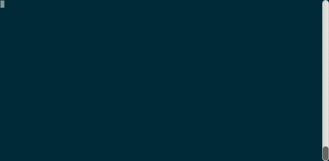

# FTP client

Bare bones, command-line FTP client made with the intention to get more comfortable with Go.

Although it supports only passive mode with binary data transfer and most basic commands (pwd, cd, ls, get and put),
it features a progress bar for put command!

